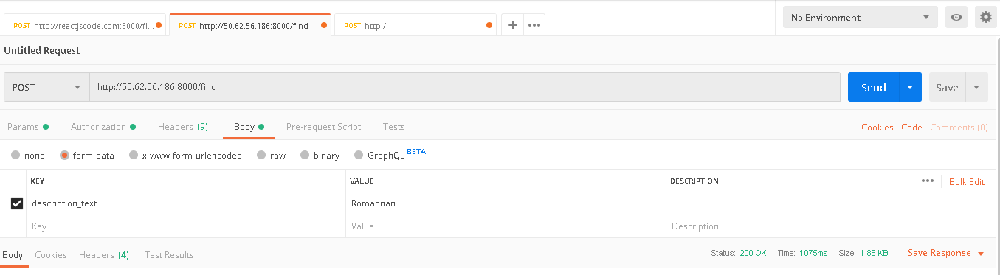

# Machine-Learning

* This flask app for "how can you help" project  

**APP Description**: The user inputs a description of how they would like to volunteer or donate their time to a cause. The input then goes through an algorithm that matches it with top 5 most compatible charities from a database.

* Using a text embedding assisted by Basilica.ai API, the app matches the user input with most relevant non-profit organizations.

To use:

**POST request**

**URL**: http://50.62.56.186:8000/find

**KEY**: description_text

**VALUE**: URL encoded string

